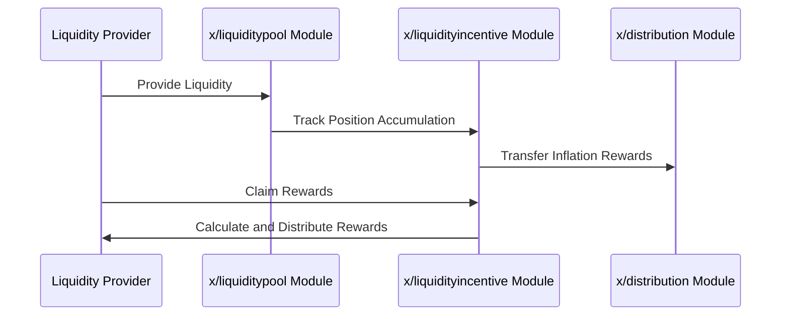

# Liquidity Incentive

The `x/liquidityincentive` module incentivizes liquidity providers by distributing rewards based on their contributions to liquidity pools. It uses an epoch-based reward system and a gauge voting mechanism to allocate rewards dynamically. This module ensures sustainable liquidity provisioning while allowing users to participate in governance through gauge voting.

See the [Bribes](./bribes.md) for more information on the bribe feature.

## Key Features

1. **Epoch-Based Reward Distribution**:
    - Rewards are distributed at the end of each epoch.
    - Lazy accounting minimizes computational overhead by calculating rewards only when claimed.
2. **Gauge Voting**:
    - Users can vote on which liquidity pools should receive incentives.
    - Voting power is determined by **`$vRISE`** tokens (non-transferable staking tokens).
3. **Lazy Accounting for Rewards**:
    - Rewards are tracked using accumulators and distributed only when users claim them.
    - This reduces the computational load on the network.
4. **Dynamic Incentive Allocation**:
    - Incentives are allocated based on pool weights (gauges) determined through voting.

## **Core Concepts**

### Epochs

> **Note:** The following section covers advanced topics intended for experienced users or developers.

- Two epochs exist concurrently:
    1. **Past Epoch**: The epoch that has ended.
    2. **Current Epoch**: The ongoing epoch.
- Each epoch has the following parameters:
  - **`id`**: The unique epoch ID.
  - **`start_block`**: The block where the epoch begins.
  - **`start_time`**: The Unix time where the epoch begins.
  - **`end_block`**: The block where the epoch ends.
  - **`gauges`**: A list of gauges (pool weights) for incentive distribution.

### Gauge

> **Note:** The following section covers advanced topics intended for experienced users or developers.

- A gauge represents a specific liquidity pool's weight in reward allocation.
- Parameters:
  - **`pool_id`**: The ID of the liquidity pool.
  - **`voting_power`**: The voting power allocated to this pool.

### Lazy Accounting

- Rewards are not distributed immediately but are calculated when claimed.
- Formula for calculating rewards:

$$
\text{ClaimAmount}_{ij} = \frac{\text{PositionUnclaimedAccumulation}_{ij}}{\text{PoolUnclaimedAccumulation}_{i}} \times \text{PoolUnclaimed}_{i}
$$

## Workflow

### BeginBlocker

1. Transfers a portion of inflation rewards from the Fee Collector account to the **`x/liquidityincentive`** module account.
1. Rewards are converted to **`$vRISE`** tokens (non-transferable staking tokens).
1. Rewards are accumulated in each pool's fee accumulator.

### MsgClaimRewards (`x/liquiditypool`)

- Users claim rewards by interacting with their positions in liquidity pools.

> **Note:**  
> The rewards discussed here are specifically **Gauge Voting rewards, allocated according to your vRISE voting power**.  
> These are distinct from standard LP rewards.  
> You claim Gauge Voting rewards by participating in Gauge Voting with your vRISE, which determines your share of the rewards for each pool per epoch.  
> This is separate from the usual LP incentives you receive for providing liquidity.

## Sequence Diagram: Reward Distribution

> **Note:** The following section covers advanced topics intended for experienced users or developers.

## Messages

The module provides various message types:

- MsgUpdateParams: Update module parameters (governance operation)
- MsgStartNewEpoch: Start a new epoch
- MsgVoteGauge: Vote on pool weights for reward distribution
- MsgRegisterBribe: Register a bribe for a specific pool and epoch
- MsgClaimBribes: Claim accumulated bribes

## Queries

The module provides various query endpoints:

- Params: Query module parameters
- Epoch: Get details of a specific epoch
- Epochs: List all epochs
- Vote: Get voting information for a specific address
- Votes: List all votes
- Bribe: Get details of a specific bribe
- Bribes: List all bribes with optional filters
- BribeAllocation: Get bribe allocation for a specific address, epoch, and pool
- BribeAllocations: List all bribe allocations with optional filters
- TallyResult: Get the tally result for the next epoch

See [Github](https://github.com/sunriselayer/sunrise/tree/main/x/liquidityincentive) for details.
