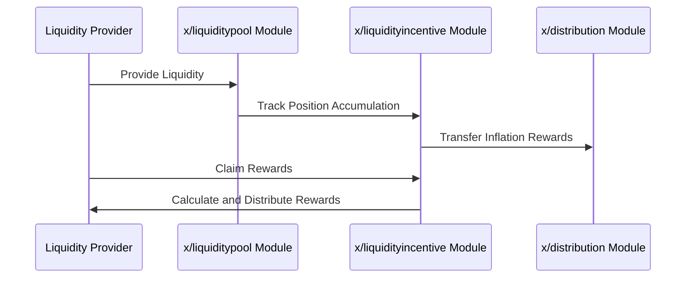

# Liquidity Incentive

The `x/liquidityincentive` module incentivizes liquidity providers by distributing rewards based on their contributions to liquidity pools. It uses an epoch-based reward system and a gauge voting mechanism to allocate rewards dynamically. This module ensures sustainable liquidity provisioning while allowing users to participate in governance through gauge voting.

## Key Features

1. **Epoch-Based Reward Distribution**:
    - Rewards are distributed at the end of each epoch.
    - Lazy accounting minimizes computational overhead by calculating rewards only when claimed.
2. **Gauge Voting**:
    - Users can vote on which liquidity pools should receive incentives.
    - Voting power is determined by **`$vRISE`** tokens (non-transferable staking tokens).
3. **Lazy Accounting for Rewards**:
    - Rewards are tracked using accumulators and distributed only when users claim them.
    - This reduces the computational load on the network.
4. **Dynamic Incentive Allocation**:
    - Incentives are allocated based on pool weights (gauges) determined through voting.

## **Core Concepts**

### Epochs

- Two epochs exist concurrently:
    1. **Past Epoch**: The epoch that has ended.
    2. **Current Epoch**: The ongoing epoch.
- Each epoch has the following parameters:
    - **`start_block`**: The block where the epoch begins.
    - **`end_block`**: The block where the epoch ends.
    - **`gauges`**: A list of gauges (pool weights) for incentive distribution.

### Gauge

- A gauge represents a specific liquidity pool's weight in reward allocation.
- Parameters:
    - **`pool_id`**: The ID of the liquidity pool.
    - **`ratio`**: The voting power allocated to this pool.

### Lazy Accounting

- Rewards are not distributed immediately but are calculated when claimed.
- Formula for calculating rewards:

$$
\text{ClaimAmount}_{ij} = \frac{\text{PositionUnclaimedAccumulation}_{ij}}{\text{PoolUnclaimedAccumulation}_{i}} \times \text{PoolUnclaimed}_{i}
$$


## Workflow

### 1. BeginBlocker

- Creates a new epoch if:
    - The last epoch has ended.
    - No epochs exist (first epoch).

### 2. EndBlocker

- Transfers a portion of inflation rewards from the**`x/distribution`**pool to the **`x/liquidityincentive`** pool.

### 3. Reward Distribution

- Rewards are accumulated in each pool's fee accumulator.
- Users claim rewards by interacting with their positions in liquidity pools.

## Sequence Diagram: Reward Distribution



## Code Examples

**Query Epoch Information:**

```javascript
import { SunriseClient } from "@sunriselayer/client";

async function queryEpochs() {
    const cometRpc = "https://sunrise-test-da.cauchye.net/";
    const client = await SunriseClient.connect(cometRpc);
    const queryClient = client.getQueryClient();

    if (!queryClient) {
        console.error("Query client not initialized");
        return;
    }

    const epochs = await queryClient.liquidityincentive.epochs({});
    console.log("Epochs:", epochs);
}
queryEpochs();

```

**Example Output:**

```json
{
  "current_epoch": {
    "start_block": "100",
    "end_block": "200",
    "gauges": [
      { "pool_id": "1", "ratio": "0.6" },
      { "pool_id": "2", "ratio": "0.4" }
    ]
  },
  "past_epoch": {
    "start_block": "0",
    "end_block": "100",
    ...
  }
}

```


See [Github](https://github.com/sunriselayer/sunrise/tree/main/x/liquidityincentive) for details.
