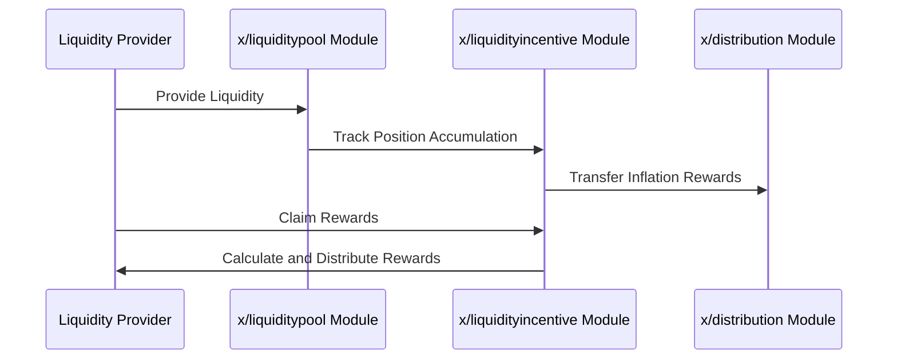

# Liquidity Incentive

The `x/liquidityincentive` module incentivizes liquidity providers by distributing rewards based on their contributions to liquidity pools. It uses an epoch-based reward system and a gauge voting mechanism to allocate rewards dynamically. This module ensures sustainable liquidity provisioning while allowing users to participate in governance through gauge voting.

See the [Bribes](./bribes.md) for more information on the bribe feature.

## Key Features

1. **Epoch-Based Reward Distribution**:
    - Rewards are distributed at the end of each epoch.
    - Lazy accounting minimizes computational overhead by calculating rewards only when claimed.
2. **Gauge Voting**:
    - Users can vote on which liquidity pools should receive incentives.
    - Voting power is determined by **`$vRISE`** tokens (non-transferable staking tokens).
3. **Lazy Accounting for Rewards**:
    - Rewards are tracked using accumulators and distributed only when users claim them.
    - This reduces the computational load on the network.
4. **Dynamic Incentive Allocation**:
    - Incentives are allocated based on pool weights (gauges) determined through voting.

## **Core Concepts**

### Epochs

> **Note:** The following section covers advanced topics intended for experienced users or developers.

- Two epochs exist concurrently:
    1. **Past Epoch**: The epoch that has ended.
    2. **Current Epoch**: The ongoing epoch.
- Each epoch has the following parameters:
  - **`id`**: The unique epoch ID.
  - **`start_block`**: The block where the epoch begins.
  - **`start_time`**: The Unix time where the epoch begins.
  - **`end_block`**: The block where the epoch ends.
  - **`gauges`**: A list of gauges (pool weights) for incentive distribution.

### Gauge

> **Note:** The following section covers advanced topics intended for experienced users or developers.

- A gauge represents a specific liquidity pool's weight in reward allocation.
- Parameters:
  - **`pool_id`**: The ID of the liquidity pool.
  - **`voting_power`**: The voting power allocated to this pool.

### Lazy Accounting

- Rewards are not distributed immediately but are calculated when claimed.
- Formula for calculating rewards:

$$
\text{ClaimAmount}_{ij} = \frac{\text{PositionUnclaimedAccumulation}_{ij}}{\text{PoolUnclaimedAccumulation}_{i}} \times \text{PoolUnclaimed}_{i}
$$

## Workflow

### BeginBlocker

1. Transfers a portion of inflation rewards from the Fee Collector account to the **`x/liquidityincentive`** module account.
1. Rewards are converted to **`$vRISE`** tokens (non-transferable staking tokens).
1. Rewards are accumulated in each pool's fee accumulator.

### MsgClaimRewards (`x/liquiditypool`)

- Users claim rewards by interacting with their positions in liquidity pools.

> **Note:**  
> The rewards discussed here are specifically **Gauge Voting rewards, allocated according to your vRISE voting power**.  
> These are distinct from standard LP rewards.  
> You claim Gauge Voting rewards by participating in Gauge Voting with your vRISE, which determines your share of the rewards for each pool per epoch.  
> This is separate from the usual LP incentives you receive for providing liquidity.

## Sequence Diagram: Reward Distribution

> **Note:** The following section covers advanced topics intended for experienced users or developers.



## Messages

### MsgUpdateParams

Updates the module parameters. This is typically a governance operation.

```protobuf
message MsgUpdateParams {
  option (cosmos.msg.v1.signer) = "authority";

  // authority is the address that controls the module (defaults to x/gov unless overwritten).
  string authority = 1 [(cosmos_proto.scalar) = "cosmos.AddressString"];

  // params defines the module parameters to update.
  // NOTE: All parameters must be supplied.
  Params params = 2 [(gogoproto.nullable) = false];
}
```

### MsgStartNewEpoch

Starts a new epoch.

```protobuf
message MsgStartNewEpoch {
  option (cosmos.msg.v1.signer) = "sender";
  string sender = 1 [(cosmos_proto.scalar) = "cosmos.AddressString"];
}
```

## Data Structures

### Params

```protobuf
message Params {
  option (gogoproto.equal) = true;

  int64 epoch_blocks = 1;
  string staking_reward_ratio = 2 [(cosmos_proto.scalar) = "cosmos.Dec"];
  uint64 bribe_claim_epochs = 3;
}
```

### Epoch

Defines epoch information.

```protobuf
message Epoch {
  uint64 id = 1 [(amino.dont_omitempty) = true];
  int64 start_block = 2 [(amino.dont_omitempty) = true];
  int64 start_time = 3 [(amino.dont_omitempty) = true];
  int64 end_block = 4 [(amino.dont_omitempty) = true];
  repeated Gauge gauges = 5 [(gogoproto.nullable) = false];
}
```

### Gauge (TallyResult)

Defines gauge information.

```protobuf
message Gauge {
  uint64 pool_id = 1;
  string voting_power = 2 [
    (cosmos_proto.scalar) = "cosmos.Int",
    (gogoproto.customtype) = "cosmossdk.io/math.Int",
    (gogoproto.nullable) = false
  ];
}
```

## Queries

The module provides the following query endpoints:

- `Params`: Queries the current parameters of the module.
- `Epoch`: Queries information about a specific epoch.
- `Epochs`: Queries a list of all epochs.

### Query Examples

```protobuf
// Query params
message QueryParamsRequest {}

message QueryParamsResponse {
  // params holds all the parameters of this module.
  Params params = 1 [(gogoproto.nullable) = false];
}

// Query epoch information
message QueryEpochRequest {
  uint64 id = 1;
}

message QueryEpochResponse {
  Epoch epoch = 1 [(gogoproto.nullable) = false];
}

// Query existing epoch information
message QueryEpochsRequest {
  cosmos.base.query.v1beta1.PageRequest pagination = 1;
}

message QueryEpochsResponse {
  repeated Epoch epochs = 1 [(gogoproto.nullable) = false];
  cosmos.base.query.v1beta1.PageResponse pagination = 2;
}
```

See [Github](https://github.com/sunriselayer/sunrise/tree/main/x/liquidityincentive) for details.

## Code Examples

**Query Epoch Information:**

```javascript
import { SunriseClient } from "@sunriselayer/client";

async function queryEpochs() {
    const cometRpc = "https://sunrise-test-da.cauchye.net/";
    const client = await SunriseClient.connect(cometRpc);
    const queryClient = client.getQueryClient();

    if (!queryClient) {
        console.error("Query client not initialized");
        return;
    }

    const epochs = await queryClient.liquidityincentive.epochs({});
    console.log("Epochs:", epochs);
}
queryEpochs();
```

**Example Output:**

```json
{
　"epochs": {
  　"current_epoch": {
   　 "start_block": "100",
  　  "start_time": "1747197500",
  　  "end_block": "200",
  　　 "gauges": [
   　   { "pool_id": "1", "voting_power": "6000000" },
   　   { "pool_id": "2", "voting_power": "4000000" }
  　  ]
  　},
　}
}
```

See [Github](https://github.com/sunriselayer/sunrise/tree/main/x/liquidityincentive) for details.
