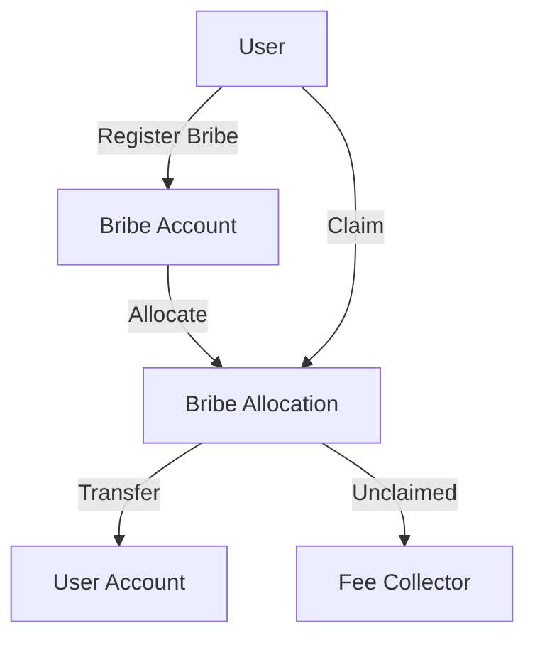

# Bribes

The `x/liquidityincentive` module implements a protocol-level mechanism that allows applications to reward vRISE holders for directing votes to specific pools. This creates an efficient market for liquidity allocation through a bribe-based incentive system.

## Key Features

1. **Protocol-Level Bribes:**
   * Applications can offer bribes to attract liquidity to specific pools
   * vRISE holders are incentivized to direct votes to pools with higher bribes
   * Creates an efficient market for liquidity allocation
2. **Epoch-Based System:**
   * Bribes are tied to specific epochs
   * System tracks expired epochs
   * Unclaimed bribes from expired epochs are processed and sent to fee collector
3. **Weight-Based Distribution:**
   * Fair allocation based on vote weights
   * Prevents double claiming
   * Transparent and verifiable on-chain
4. **Economic Efficiency:**
   * Creates a market for liquidity allocation
   * vRISE holders can maximize returns by directing votes
   * Unclaimed rewards are recycled to fee collector

## Core Functionality

> **Note:** The following section covers advanced topics intended for experienced users or developers.

### Bribe Management

**Each bribe is defined by several parameters:**

* `id`: Unique identifier for the bribe
* `epoch_id`: The epoch for which the bribe is valid
* `pool_id`: The pool to which the bribe applies
* `address`: The sender's address
* `amount`: Total amount of the bribe
* `claimed_amount`: Amount already claimed by voters

### Bribe Allocation

The system tracks how bribes are allocated to voters:

* `address`: Voter's address
* `epoch_id`: Epoch for which the allocation is valid
* `pool_id`: Pool to which the allocation applies
* `weight`: Weight of the voter's votes
* `claimed_bribe_ids`: List of bribe IDs already claimed

***

## Bribe System Architecture & Flow

### Key Components and Flows

#### Bribe Registration

* **User registers a bribe** by sending coins to the Bribe Account in the Liquidity Incentive module.
* The system **creates a Bribe record** (with unique ID, epoch, pool, amount, and claimed amount).
* When the epoch starts, **Bribe allocations** are created for voters based on their vote weights for the pool in that epoch.

#### Bribe Claiming

* **User initiates a claim** for their bribe allocation.
* The system:
  * Verifies the bribe exists and is valid for the epoch/pool.
  * Checks the user's allocation and ensures the bribe hasn't been claimed.
  * Calculates the claimable amount based on the user's vote weight.
  * Transfers the appropriate amount from the Bribe Account to the user.
  * Updates the claimed amount and allocation records.

#### Fee Processing

* Unclaimed bribes from expired epochs are **returned to the Fee Collector**.
* Fees are processed:
  * Transferred from the Fee Collector to the module account.
  * Converted to the bond denomination if needed.
  * Distributed to liquidity pools as incentives.

#### Cleanup (Unclaimed Bribes)

* At the end of each epoch, the system:
  * Processes expired epochs.
  * Calculates unclaimed bribe amounts.
  * Returns unclaimed funds to the Fee Collector.
  * Cleans up expired bribe and allocation records.

#### State Transitions

* **Bribe:** Created → Active → Claimed/Expired
* **Allocation:** Created → Active → Claimed/Expired
* **Funds:** User → Bribe Account → User/Fee Collector

***

### Bribe System Flowchart

**Flow Explanation:**

1. The user registers a bribe, which is deposited into the Bribe Account.
2. The system allocates bribe shares to eligible voters based on their voting weights.
3. Users can claim their allocated bribe rewards from the Bribe Allocation.
4. Claimed rewards are transferred to the user's account.
5. Any unclaimed bribes after the claim period are sent to the Fee Collector for redistribution or burning.

***

## Integration Points

The bribe module integrates with several other modules:

* Bank module for coin transfers
* Account module for address handling
* Staking module for vRISE holders
* Governance module for parameter updates

See [Liquidity Incentive](./) for more system details.
