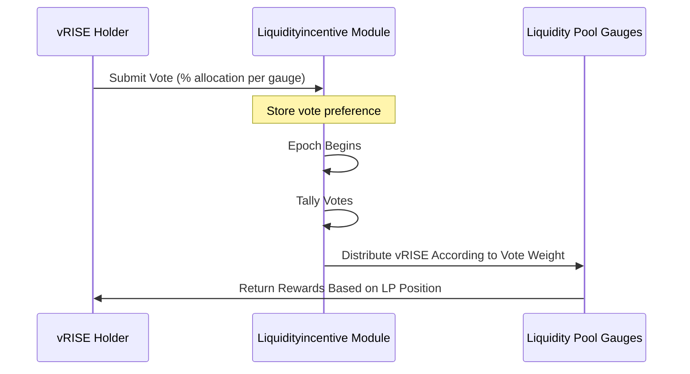

# Gauges Voting

## What is a Gauge?

A Gauge in the Sunrise ecosystem is a mechanism that governs the issuance of `vRISE` tokens. Currently, the primary gauge product is the Liquidity Pool system.

`vRISE` holders can vote to determine the allocation of newly minted `vRISE` tokens across different gauges. Liquidity pools that attract more voting power will receive a larger share of newly issued vRISE tokens, creating an incentive mechanism that aligns with community preferences.

## How the Voting System Works

> **Note:** The following section covers advanced topics intended for experienced users or developers.

### Epoch-Based Voting

Gauge weight voting operates on an epoch system:

* Each epoch spans a predefined number of blocks (configurable via governance)
* Votes are tallied at the beginning of each new epoch
* Vote weight is determined by the voter's voting power at epoch starts
* Voting is cleared when a new epoch starts

> **Note:**\
> The rewards discussed here are specifically **Gauge Voting rewards, allocated according to your vRISE voting power**.\
> These are distinct from standard LP rewards.\
> Rewards are accumulated in the user's position and can be claimed at the same time as standard LP rewards in MsgClaimRewards (x/liquiditypool)

### Eligibility Requirements

To participate in gauge voting:

* **Token Requirement**: You must earn `vRISE` tokens, primarily by providing liquidity to pools
* **Voting Power**: Voting Power can be gained by delegating to a validator.
* **Tally Timing:** The voting pawer at the start of the epoch is applied.

You can submit your vote even before you have voting power. Your voting preferences will be applied based on whatever voting power you have when the next epoch begins.

## How to Vote

### Step 1: Access Your Voting Dashboard

Click **My Votes** to begin the voting process.

### Step 2: Select Gauges

1. Click "Select Pool" to open the pool selection interface
2. Choose the pools/gauges you wish to support
3. Your previous voting selections will be automatically loaded if applicable
4. Remove unwanted gauges by clicking the delete button

### Step 3: Allocate Voting Power

Specify what percentage of your voting power to allocate to each selected gauge:

* **Percentage-Based:** Allocations are specified as percentages rather than absolute amounts because:
  * Your vRISE balance may fluctuate between epochs
  * Percentage allocations automatically adjust to your current balance at epoch start
  * This approach eliminates the need to revote every epoch

### Step 4: Preview and Submit

1. Use the "Preview Vote" feature to see how your current vRISE balance would be distributed
2. Confirm your selections
3. Click Vote to submit your transaction
4. Your vote preferences will be applied to all future epochs until changed

### Step 5: Update (Optional)

You can modify your vote at any time:

* Your latest voting decision before an epoch begins will be applied
* Changes take effect at the next epoch boundary
* Simply repeat the voting process to update your preferences

See [Liquidity Incentive](./) for more system details.
