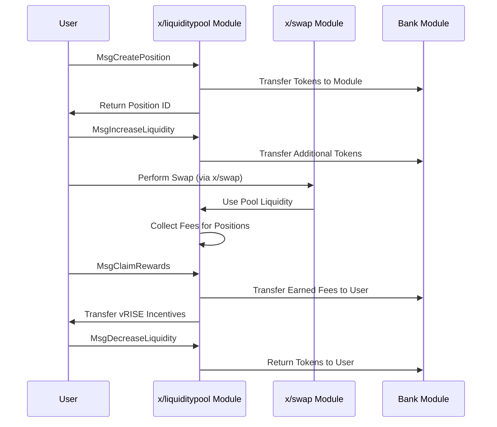

# Liquidity Pool

The `x/liquiditypool` module implements a concentrated liquidity automated market maker (AMM) mechanism for the Sunrise blockchain. This module enables users to create liquidity pools, add positions with specific price ranges, and earn rewards from trading fees and incentives.

## Key Features

1. **Concentrated Liquidity AMM:**

   - Follows a similar model to Uniswap V3, allowing liquidity providers to concentrate their assets within specific price ranges.
   - Improves capital efficiency compared to traditional constant product AMMs.

2. **Position-Based Liquidity:**

   - Users create positions with defined price ranges (ticks).
   - Each position has a unique ID and tracks the liquidity provider's contribution.

3. **Fee Generation:**

   - Positions earn fees from trades that occur within their price range.
   - Fees are collected in the base and quote denominations of the pool.

4. **`vRISE` Incentives:**

   - Liquidity providers earn vRISE tokens as additional incentives.
   - For more information, see [Liquidity Incentive](./liquidity-incentive.md)

## Core Functionality

> **Note:** The following section covers advanced topics intended for experienced users or developers.

### Pool Management

**Each pool is defined by several parameters:**

- `id`: Unique identifier for the pool
- `denom_base` & `denom_quote`: The token pair denominations
- `fee_rate`: The fee charged on swaps within the pool
- `tick_params`: Parameters defining the tick system
- `current_tick`, `current_tick_liquidity`, `current_sqrt_price`: Current state variables

### Tick System

The tick system is based on a price ratio formula:

$$
\mathrm{price}(\mathrm{tick}) = \mathrm{price\_ratio}^{\mathrm{tick} - \mathrm{base\_offset}}
$$

In the typical case with `price_ratio = 1.0001` and `base_offset = 0`:

$$
\mathrm{price}(\mathrm{tick}) = 1.0001^{\mathrm{tick}}
$$

This allows for precise positioning of liquidity within specific price ranges.

## Workflow: Creating and Using Positions

> **Note:** The following section covers advanced topics intended for experienced users or developers.



## Messages

### MsgCreatePool

Creates a new liquidity pool with specified parameters.

```protobuf
message MsgCreatePool {
  option (cosmos.msg.v1.signer) = "sender";
  string sender = 1 [(cosmos_proto.scalar) = "cosmos.AddressString"];
  string denom_base = 2;
  string denom_quote = 3;
  string fee_rate = 4;
  // Basically 1.0001
  string price_ratio = 5;
  // basically 0 and (-1, 0]. In the 1:1 stable pair, 0.5 would work
  string base_offset = 6;
}
```

### MsgCreatePosition

Creates a position within a price range in a pool.

```protobuf
message MsgCreatePosition {
  option (cosmos.msg.v1.signer) = "sender";
  string sender = 1 [(cosmos_proto.scalar) = "cosmos.AddressString"];
  uint64 pool_id = 2;
  int64 lower_tick = 3;
  int64 upper_tick = 4;
  cosmos.base.v1beta1.Coin token_base = 5 [(gogoproto.nullable) = false];
  cosmos.base.v1beta1.Coin token_quote = 6 [(gogoproto.nullable) = false];
  string min_amount_base = 7 [
    (cosmos_proto.scalar) = "cosmos.Int",
    (gogoproto.customtype) = "cosmossdk.io/math.Int",
    (gogoproto.nullable) = false
  ];
  string min_amount_quote = 8 [
    (cosmos_proto.scalar) = "cosmos.Int",
    (gogoproto.customtype) = "cosmossdk.io/math.Int",
    (gogoproto.nullable) = false
  ];
}
```

### MsgIncreaseLiquidity

Claims unclaimed rewards and adds liquidity to an existing position. The position ID will be updated to new one.

```protobuf
message MsgIncreaseLiquidity {
  option (cosmos.msg.v1.signer) = "sender";
  string sender = 1 [(cosmos_proto.scalar) = "cosmos.AddressString"];
  uint64 id = 2;
  string amount_base = 3 [
    (cosmos_proto.scalar) = "cosmos.Int",
    (gogoproto.customtype) = "cosmossdk.io/math.Int",
    (gogoproto.nullable) = false
  ];
  string amount_quote = 4 [
    (cosmos_proto.scalar) = "cosmos.Int",
    (gogoproto.customtype) = "cosmossdk.io/math.Int",
    (gogoproto.nullable) = false
  ];
  string min_amount_base = 5 [
    (cosmos_proto.scalar) = "cosmos.Int",
    (gogoproto.customtype) = "cosmossdk.io/math.Int",
    (gogoproto.nullable) = false
  ];
  string min_amount_quote = 6 [
    (cosmos_proto.scalar) = "cosmos.Int",
    (gogoproto.customtype) = "cosmossdk.io/math.Int",
    (gogoproto.nullable) = false
  ];
}
```

### MsgDecreaseLiquidity

Claims unclaimed rewards and removes liquidity from an existing position.

```protobuf
message MsgDecreaseLiquidity {
  option (cosmos.msg.v1.signer) = "sender";
  string sender = 1 [(cosmos_proto.scalar) = "cosmos.AddressString"];
  uint64 id = 2;
  string liquidity = 3;
}
```

### MsgClaimRewards

Claims accumulated fees and incentives for positions.

```protobuf
message MsgClaimRewards {
  option (cosmos.msg.v1.signer) = "sender";
  string sender = 1 [(cosmos_proto.scalar) = "cosmos.AddressString"];
  repeated uint64 position_ids = 2;
}
```

## Example Usage

### **Create a Position**

```javascript
import { SunriseClient } from "@sunriselayer/client";
import { MsgCreatePosition } from "@sunriselayer/client/types";

async function createPosition() {
    const client = await SunriseClient.connect("https://rpc.sunriselayer.io");
    
    const msgCreatePosition = {
        sender: "sunrise1...",
        poolId: 1,
        lowerTick: -4155,  // Approximately price 0.66
        upperTick: 4054,   // Approximately price 1.5
        tokenBase: { denom: "urise", amount: "1000000" },
        tokenQuote: { denom: "uusdc", amount: "1000000" },
        minAmountBase: "0",
        minAmountQuote: "0"
    };
    
    const result = await client.executeTransaction(msgCreatePosition);
    console.log("Position created:", result);
}
```

## Queries

The module provides various query endpoints:

- Params: Query module parameters
- Pools: List all liquidity pools
- Pool: Get details of a specific pool
- Positions: List all positions
- Position: Get details of a specific position
- PoolPositions: List positions in a specific pool
- AddressPositions: List positions owned by an address
- PositionFees: Get accrued fees for a position
- CalculationCreatePosition: Preview position creation
- CalculationIncreaseLiquidity: Preview liquidity increase

See [Github](https://github.com/sunriselayer/sunrise/tree/main/x/liquiditypool) for details.
