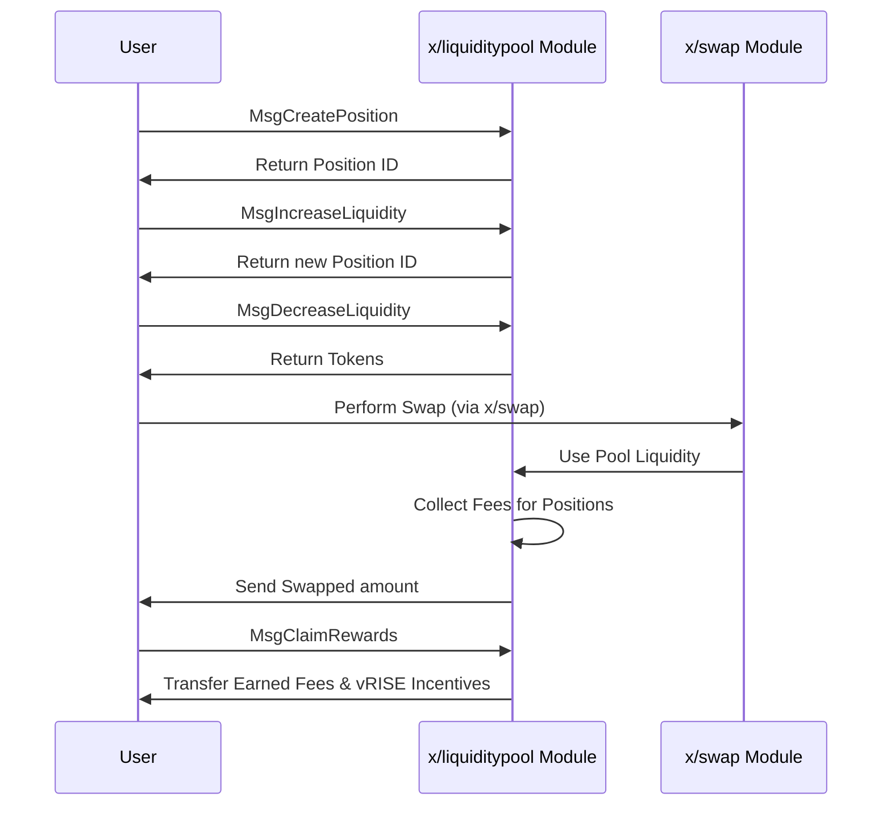

# Liquidity Pool

The `x/liquiditypool` module implements a concentrated liquidity automated market maker (AMM) mechanism for the Sunrise blockchain. This module enables users to create liquidity pools, add positions with specific price ranges, and earn rewards from trading fees and incentives.

## Key Features

1. **Concentrated Liquidity AMM:**
   * Follows a similar model to Uniswap V3, allowing liquidity providers to concentrate their assets within specific price ranges.
   * Improves capital efficiency compared to traditional constant product AMMs.
2. **Position-Based Liquidity:**
   * Users create positions with defined price ranges (ticks).
   * Each position has a unique ID and tracks the liquidity provider's contribution.
3. **Fee Generation:**
   * Positions earn fees from trades that occur within their price range.
   * Fees are collected in the base and quote denominations of the pool.
4. **`vRISE` Incentives:**
   * Liquidity providers earn vRISE tokens as additional incentives.
   * For more information, see [Liquidity Incentive](liquidity-incentive/)

## Core Functionality

> **Note:** The following section covers advanced topics intended for experienced users or developers.

### Pool Management

**Each pool is defined by several parameters:**

* `id`: Unique identifier for the pool
* `denom_base` & `denom_quote`: The token pair denominations
* `fee_rate`: The fee charged on swaps within the pool
* `tick_params`: Parameters defining the tick system
* `current_tick`, `current_tick_liquidity`, `current_sqrt_price`: Current state variables

### Tick System

The tick system is based on a price ratio formula:

$$
\mathrm{price}(\mathrm{tick}) = \mathrm{price\_ratio}^{\mathrm{tick} - \mathrm{base\_offset}}
$$

In the typical case with `price_ratio = 1.0001` and `base_offset = 0`:

$$
\mathrm{price}(\mathrm{tick}) = 1.0001^{\mathrm{tick}}
$$

This allows for precise positioning of liquidity within specific price ranges.

## Workflow: Creating and Using Positions

> **Note:** The following section covers advanced topics intended for experienced users or developers.

## Messages

The module provides various message types:

* MsgUpdateParams: Update module parameters (governance operation)
* MsgCreatePool: Create a new liquidity pool with specified parameters
* MsgCreatePosition: Create a position within a price range in a pool
* MsgIncreaseLiquidity: Add liquidity to an existing position
* MsgDecreaseLiquidity: Remove liquidity from an existing position
* MsgClaimRewards: Claim accumulated fees and incentives for positions

## Queries

The module provides various query endpoints:

* Params: Query module parameters
* Pool: Get details of a specific pool
* Pools: List all liquidity pools
* Position: Get details of a specific position
* Positions: List all positions
* PoolPositions: List positions in a specific pool
* AddressPositions: List positions owned by an address
* PositionFees: Get accrued fees for a position
* CalculationCreatePosition: Preview position creation
* CalculationIncreaseLiquidity: Preview liquidity increase

See [Github](https://github.com/sunriselayer/sunrise/tree/main/x/liquiditypool) for details.
