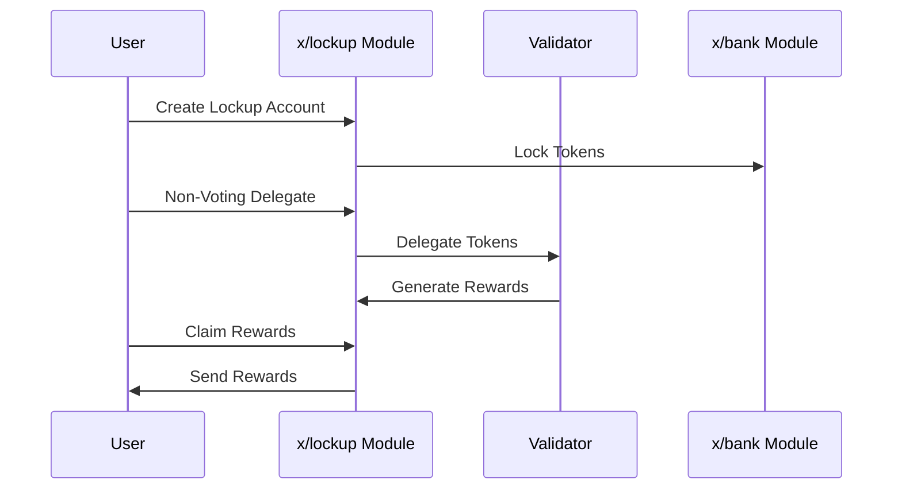

# Lockup

The `x/lockup` module provides functionality for managing token lockups and delegations. This module supports operations such as creating lockup accounts, non-voting delegation, reward claiming, and token transfers.

## Key Features

1. **Lockup Account Management**:
    - Creation and management of lockup accounts
    - Setting lockup periods (start and end times)
    - Tracking of locked tokens

2. **Non-Voting Delegation**:
    - Delegation of locked tokens to validators
    - Undelegation functionality
    - Delegation reward claiming

3. **Token Management**:
    - Transfer of locked tokens
    - Querying spendable amounts
    - Tracking lockup status

## Core Concepts

### Lockup Account

> **Note:** The following section covers advanced topics intended for experienced users or developers.

A lockup account is defined by the following parameters:

- **`address`**: The lockup account address
- **`owner`**: The account owner's address
- **`id`**: Unique identifier for the lockup account
- **`start_time`**: Lockup start time (Unix timestamp)
- **`end_time`**: Lockup end time (Unix timestamp)
- **`original_locking`**: Original locked amount
- **`delegated_free`**: Amount of delegated transfers available
- **`delegated_locking`**: Delegated amount of locking amount
- **`unbond_entries`**: List of unbonding entries
- **`additional_locking`**: Additional locked amount

### Unbonding Entry

An unbonding entry is defined by the following parameters:

- **`creation_height`**: Block height when the entry was created
- **`end_time`**: End time of the entry
- **`amount`**: Unbonding amount
- **`validator_address`**: Validator's address

## Workflow

### 1. Lockup Account Initialization

- User creates a lockup account
- Sets lockup period and amount
- Specifies account owner

### 2. Non-Voting Delegation

- Delegates locked tokens to validators
- Executes undelegation
- Claims delegation rewards

### 3. Token Transfer

- Transfers tokens from lockup account
- Verifies spendable amount
- Executes transfer

## Sequence Diagram: Lockup Operations



## Code Examples

**Query Lockup Account Information:**

```javascript
import { SunriseClient } from "@sunriselayer/client";

async function queryLockupAccount() {
    const cometRpc = "https://sunrise-test-da.cauchye.net/";
    const client = await SunriseClient.connect(cometRpc);
    const queryClient = client.getQueryClient();

    if (!queryClient) {
        console.error("Query client not initialized");
        return;
    }

    const account = await queryClient.lockup.lockupAccount({
        owner: "sunrise1...",
        lockup_account_id: "1"
    });
    console.log("Lockup Account:", account);
}
queryLockupAccount();
```

**Example Output:**

```json
{
  "lockup_account": {
    "address": "sunrise1...",
    "owner": "sunrise1...",
    "id": "1",
    "start_time": "1747197500",
    "end_time": "1747197500",
    "original_locking": "1000000",
    "delegated_free": "0",
    "delegated_locking": "1000000",
    "unbond_entries": {
      "entries": []
    },
    "additional_locking": "0"
  },
  "locked_amount": "1000000",
  "unlocked_amount": "0"
}
```

## Messages

### MsgUpdateParams

Updates the module parameters.

```protobuf
message MsgUpdateParams {
  option (cosmos.msg.v1.signer) = "authority";

  // authority is the address that controls the module (defaults to x/gov unless overwritten).
  string authority = 1 [(cosmos_proto.scalar) = "cosmos.AddressString"];

  // params defines the module parameters to update.
  // NOTE: All parameters must be supplied.
  Params params = 2 [(gogoproto.nullable) = false];
}
```

### MsgInitLockupAccount

Initializes a new lockup account.

```protobuf
message MsgInitLockupAccount {
  option (cosmos.msg.v1.signer) = "sender";
  string sender = 1 [(cosmos_proto.scalar) = "cosmos.AddressString"];
  string owner = 2 [(cosmos_proto.scalar) = "cosmos.AddressString"];
  // start of lockup as unix time (in seconds).
  int64 start_time = 3;
  // end of lockup as unix time (in seconds).
  int64 end_time = 4;
  cosmos.base.v1beta1.Coin amount = 5 [(gogoproto.nullable) = false];
}
```

### MsgNonVotingDelegate

Delegates tokens from a lockup account without voting rights.

```protobuf
message MsgNonVotingDelegate {
  option (cosmos.msg.v1.signer) = "owner";
  string owner = 1 [(cosmos_proto.scalar) = "cosmos.AddressString"];
  uint64 lockup_account_id = 2;
  string validator_address = 3 [(cosmos_proto.scalar) = "cosmos.ValidatorAddressString"];
  cosmos.base.v1beta1.Coin amount = 4 [(gogoproto.nullable) = false];
}
```

### MsgNonVotingUndelegate

Undelegates tokens from a non-voting delegation.

```protobuf
message MsgNonVotingUndelegate {
  option (cosmos.msg.v1.signer) = "owner";
  string owner = 1 [(cosmos_proto.scalar) = "cosmos.AddressString"];
  uint64 lockup_account_id = 2;
  string validator_address = 3 [(cosmos_proto.scalar) = "cosmos.ValidatorAddressString"];
  cosmos.base.v1beta1.Coin amount = 4 [(gogoproto.nullable) = false];
}
```

### MsgClaimRewards

Claims delegation rewards for a lockup account.

```protobuf
message MsgClaimRewards {
  option (cosmos.msg.v1.signer) = "owner";
  string owner = 1 [(cosmos_proto.scalar) = "cosmos.AddressString"];
  uint64 lockup_account_id = 2;
  string validator_address = 3 [(cosmos_proto.scalar) = "cosmos.ValidatorAddressString"];
}
```

### MsgSend

Sends tokens from a lockup account to another address.

```protobuf
message MsgSend {
  option (cosmos.msg.v1.signer) = "owner";
  string owner = 1 [(cosmos_proto.scalar) = "cosmos.AddressString"];
  uint64 lockup_account_id = 2;
  string recipient = 3 [(cosmos_proto.scalar) = "cosmos.AddressString"];
  repeated cosmos.base.v1beta1.Coin amount = 4 [
    (gogoproto.nullable) = false,
    (amino.dont_omitempty)   = true,
    (amino.encoding)         = "legacy_coins",
    (gogoproto.castrepeated) = "github.com/cosmos/cosmos-sdk/types.Coins"
  ];
}
```

## Queries

The module provides various query endpoints:

- `Params`: Queries the parameters of the module.
- `LockupAccounts`: Queries all lockup accounts for a given owner.
- `LockupAccount`: Queries a lockup account for a given owner and id.
- `SpendableAmount`: Queries the spendable amount for a given owner and id.

See [Github](https://github.com/sunriselayer/sunrise/tree/main/x/lockup) for details.
