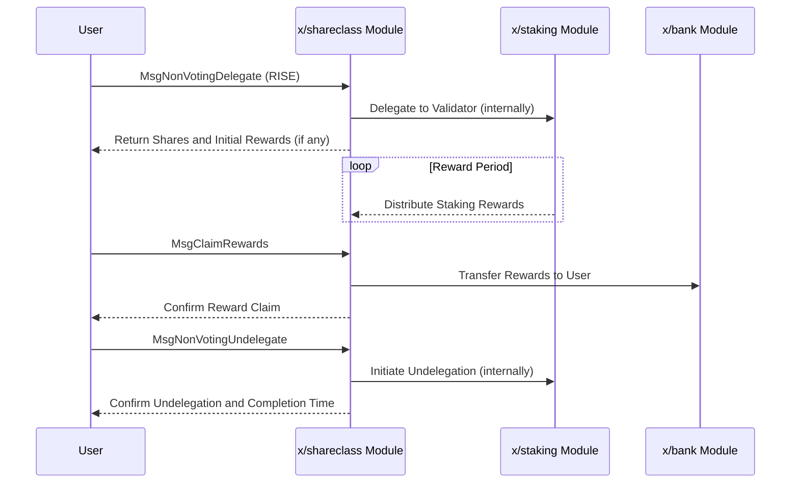

# Shareclass

The `x/shareclass` module enables users to delegate their RISE tokens without voting rights and earn staking rewards. This allows participation in staking using RISE tokens even without holding `$vRISE` (non-transferable staking tokens).

## Key Features

1. **Non-Voting Delegation with RISE:**
    * Users can delegate their RISE tokens to validators.
    * Delegation does not grant voting rights, separating staking rewards from governance participation.
2. **Earning Staking Rewards:**
    * Delegators earn staking rewards based on their delegated RISE amount.
    * Provides an alternative way to earn rewards for RISE token holders.
3. **Validator Creation:**
    * Supports the creation of new validators within the network.

## Core Concepts

### Non-Voting Delegation

Users can delegate their RISE tokens to a chosen validator. The module handles the calculation of shares and rewards. This mechanism allows users to benefit from staking rewards without needing to manage `$vRISE` tokens or participate in governance directly.

### Reward Calculation

Staking rewards are calculated based on the amount of RISE delegated and the reward parameters of the module. Users can claim their accumulated rewards.

## Workflow

### 1. Delegate RISE (Non-Voting)

* User sends a `MsgNonVotingDelegate` transaction, specifying the validator and the amount of RISE to delegate.
* The module records the delegation and calculates the corresponding shares.

### 2. Claim Rewards

* User sends a `MsgClaimRewards` transaction to claim their accumulated staking rewards for a specific validator.
* The module transfers the rewards to the user's account.

### 3. Undelegate RISE (Non-Voting)

* User sends a `MsgNonVotingUndelegate` transaction to withdraw their delegated RISE.
* The module processes the undelegation request, and the tokens become available after an unbonding period.

### 4. Create Validator (Optional)

* A user can send a `MsgCreateValidator` transaction to register a new validator node on the network.

## Sequence Diagram: Non-Voting Delegation and Rewards



## Messages

### MsgUpdateParams

Updates the module parameters. This is typically a governance operation.

```protobuf
message MsgUpdateParams {
  option (cosmos.msg.v1.signer) = "authority";

  // authority is the address that controls the module (defaults to x/gov unless overwritten).
  string authority = 1 [(cosmos_proto.scalar) = "cosmos.AddressString"];

  // params defines the module parameters to update.
  // NOTE: All parameters must be supplied.
  Params params = 2 [(gogoproto.nullable) = false];
}
```

### MsgNonVotingDelegate

Allows a user to delegate RISE tokens to a validator without gaining voting rights.

```protobuf
message MsgNonVotingDelegate {
  option (cosmos.msg.v1.signer) = "sender";
  string sender = 1 [(cosmos_proto.scalar) = "cosmos.AddressString"];
  string validator_address = 2 [(cosmos_proto.scalar) = "cosmos.ValidatorAddressString"];
  cosmos.base.v1beta1.Coin amount = 3 [(gogoproto.nullable) = false];
}
```

### MsgNonVotingUndelegate

Allows a user to undelegate their RISE tokens from a non-voting delegation.

```protobuf
message MsgNonVotingUndelegate {
  option (cosmos.msg.v1.signer) = "sender";
  string sender = 1 [(cosmos_proto.scalar) = "cosmos.AddressString"];
  string validator_address = 2 [(cosmos_proto.scalar) = "cosmos.ValidatorAddressString"];
  cosmos.base.v1beta1.Coin amount = 3 [(gogoproto.nullable) = false];
  string recipient = 4 [(cosmos_proto.scalar) = "cosmos.AddressString"];
}
```

### MsgClaimRewards

Allows a user to claim accumulated staking rewards from their non-voting delegation.

```protobuf
message MsgClaimRewards {
  option (cosmos.msg.v1.signer) = "sender";
  string sender = 1 [(cosmos_proto.scalar) = "cosmos.AddressString"];
  string validator_address = 2 [(cosmos_proto.scalar) = "cosmos.ValidatorAddressString"];
}
```

### MsgCreateValidator

Allows an account to create a new validator in the network.

```protobuf
message MsgCreateValidator {
  option (cosmos.msg.v1.signer) = "validator_address";

  cosmos.staking.v1beta1.Description description = 1 [(gogoproto.nullable) = false];
  cosmos.staking.v1beta1.CommissionRates commission = 2 [(gogoproto.nullable) = false];
  string min_self_delegation = 3 [
    (cosmos_proto.scalar) = "cosmos.Int",
    (gogoproto.customtype) = "cosmossdk.io/math.Int",
    (gogoproto.nullable) = false
  ];
  string validator_address = 4 [(cosmos_proto.scalar) = "cosmos.ValidatorAddressString"];
  google.protobuf.Any pubkey = 5 [(cosmos_proto.accepts_interface) = "cosmos.crypto.PubKey"];
  cosmos.base.v1beta1.Coin amount = 6 [(gogoproto.nullable) = false];
}
```

## Queries

The module provides various query endpoints to retrieve information:

* `Params`: Queries the current parameters of the `x/shareclass` module.
* `CalculateBondingAmount`: Calculates the amount of tokens that would be bonded for a given amount of shares with a specific validator.
* `CalculateShare`: Calculates the amount of shares that would be received for a given amount of bonded tokens with a specific validator.
* `AddressBonded`: Queries the total bonded amount for a specific address across all validators they have delegated to via this module.
* `ClaimableRewards`: Queries the amount of rewards an address can currently claim from a specific validator.
* `AddressUnbonding`: Queries the unbonding delegations for a specific address.

See [Github](https://github.com/sunriselayer/sunrise/tree/main/x/shareclass) for details (assuming the link structure).
