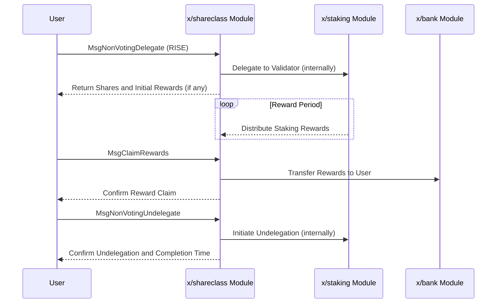

# Shareclass

The `x/shareclass` module enables users to delegate their RISE tokens without voting rights and earn staking rewards. This allows participation in staking using RISE tokens even without holding `$vRISE` (non-transferable staking tokens).

## Key Features

1. **Non-Voting Delegation with RISE:**
    * Users can delegate their RISE tokens to validators.
    * Delegation does not grant voting rights, separating staking rewards from governance participation.
2. **Earning Staking Rewards:**
    * Delegators earn staking rewards based on their delegated RISE amount.
    * Provides an alternative way to earn rewards for RISE token holders.
3. **Validator Creation:**
    * Supports the creation of new validators within the network.

## Core Concepts

### Non-Voting Delegation

Users can delegate their RISE tokens to a chosen validator. The module handles the calculation of shares and rewards. This mechanism allows users to benefit from staking rewards without needing to manage `$vRISE` tokens or participate in governance directly.

### Reward Calculation

Staking rewards are calculated based on the amount of RISE delegated and the reward parameters of the module. Users can claim their accumulated rewards.

## Workflow

### 1. Delegate RISE (Non-Voting)

* User sends a `MsgNonVotingDelegate` transaction, specifying the validator and the amount of RISE to delegate.
* The module records the delegation and calculates the corresponding shares.

### 2. Claim Rewards

* User sends a `MsgClaimRewards` transaction to claim their accumulated staking rewards for a specific validator.
* The module transfers the rewards to the user's account.

### 3. Undelegate RISE (Non-Voting)

* User sends a `MsgNonVotingUndelegate` transaction to withdraw their delegated RISE.
* The module processes the undelegation request, and the tokens become available after an unbonding period.

### 4. Create Validator (Optional)

* A user can send a `MsgCreateValidator` transaction to register a new validator node on the network.

## Sequence Diagram: Non-Voting Delegation and Rewards

## Messages

The module provides various message types:

* MsgUpdateParams: Update module parameters (governance operation)
* MsgNonVotingDelegate: Delegate RISE tokens to a validator without voting rights
* MsgNonVotingUndelegate: Undelegate RISE tokens from a non-voting delegation
* MsgClaimRewards: Claim accumulated staking rewards from non-voting delegation
* MsgCreateValidator: Create a new validator in the network

## Queries

The module provides various query endpoints:

* Params: Query module parameters
* CalculateBondingAmount: Calculate tokens that would be bonded for given shares
* CalculateShare: Calculate shares that would be received for given tokens
* AddressBonded: Get total bonded amount for a specific address
* ClaimableRewards: Get claimable rewards for an address from a validator
* AddressUnbonding: Get unbonding delegations for a specific address

See [Github](https://github.com/sunriselayer/sunrise/tree/main/x/shareclass) for details.
