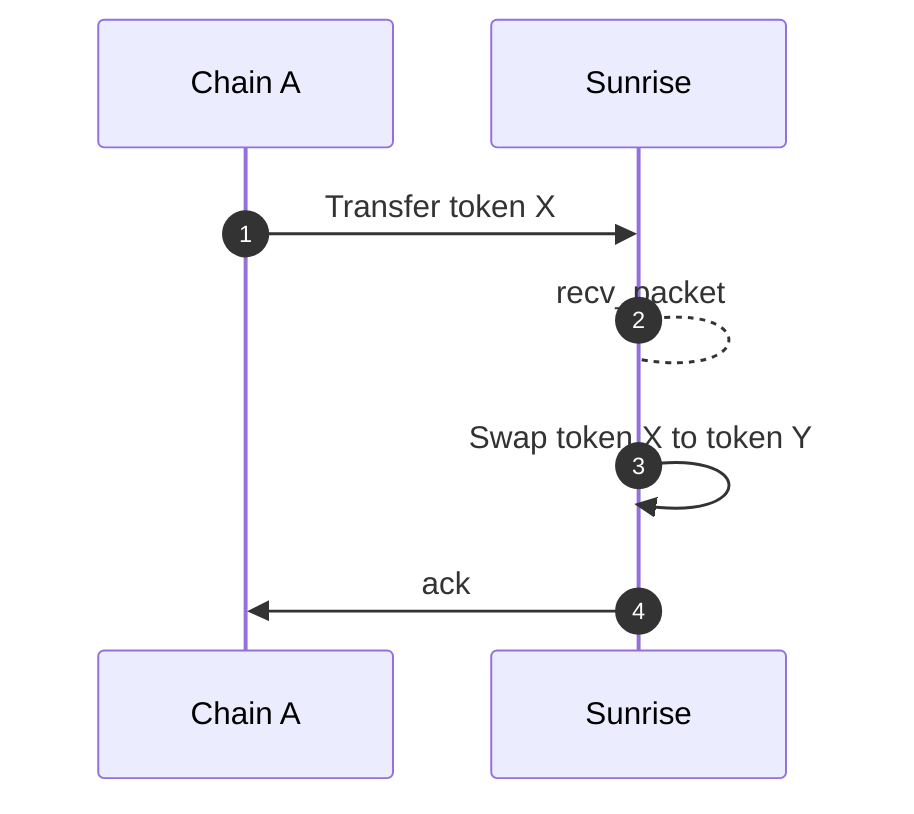
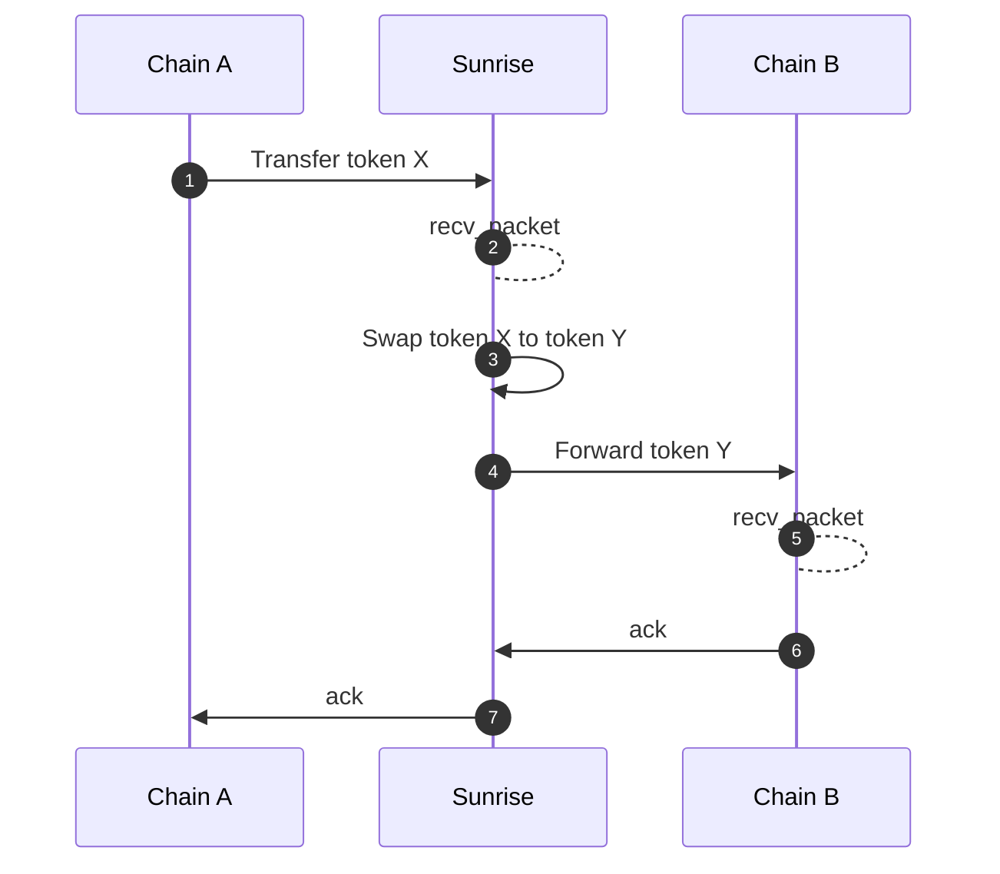
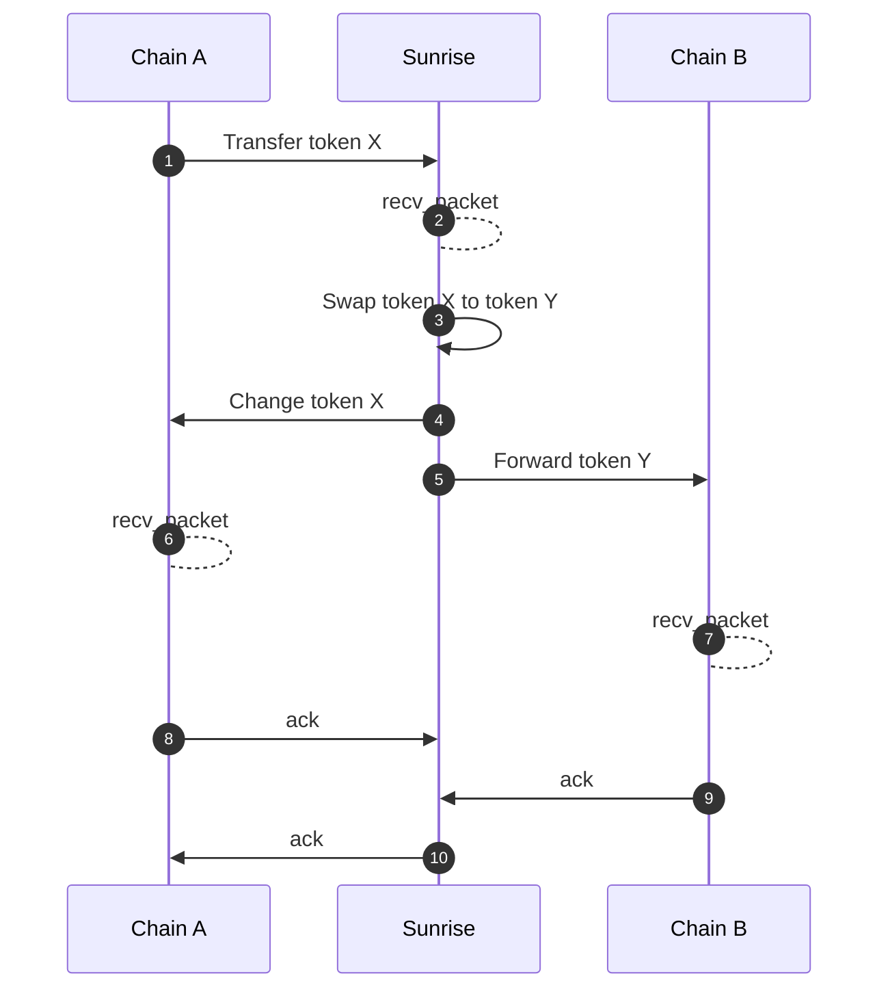

# Swap

The module `x/swap` serves the functionalities to swap tokens with the liquidity in the `x/liquiditypool` module.

## Interface Provider Fee Rewards

Any frontend application, wallet, dApp, or protocol that is built on top of the swap module has the ability to earn fees. This incentivizes open, composable infrastructure around the Sunrise AMM.

There are 2 important parameters to note:

* **interface\_fee\_rate**\
  A fee, denoted in percentage, that is taken from the total amount of the swap.
* **interface\_provider**\
  An address that specifies where the fee will be sent. If no address is provided, no interface fee will be taken.

When executing swaps through Sunrise AMM, you can **capture interface fees** by specifying your own fee recipient, maximizing profit per transaction. This function is designed to reward **any entity that facilitates swap volume**—from simple frontends to complex financial protocols.

***

### Swap Message Types

There are 2 message types that can be used to specify the amount received or the amount sent.

* **MsgSwapExactAmountIn** - Swap tokens with a specified input amount\
  This message allows users to swap tokens by defining the exact amount of input tokens they wish to provide. The corresponding output will be calculated based on the specified input.
*   **MsgSwapExactAmountOut** – Swap tokens with a specified output amount

    This message enables users to swap tokens by defining the exact amount of output tokens they want to receive. The system will calculate the necessary input amount to achieve the desired output.

***

### Route

> **Note:** The following section covers advanced topics intended for experienced users or developers.

This module supports Swap Routes with a recursive structure, allowing for complex swaps involving multiple steps, either in sequence (Series) or simultaneously (Parallel). Each step in the route is validated and processed to ensure inputs and outputs are correctly handled.

```typescript
message RoutePool {
    uint64 pool_id = 1;
}

message RouteSeries {
    repeated Route routes = 1 [
        (gogoproto.nullable)   = false,
            (amino.dont_omitempty) = true
        ];
}

message RouteParallel {
    repeated Route routes = 1 [
        (gogoproto.nullable)   = false,
            (amino.dont_omitempty) = true
        ];
    repeated string weights = 2 [
        (cosmos_proto.scalar)  = "cosmos.Dec",
            (gogoproto.customtype) = "cosmossdk.io/math.LegacyDec",
            (gogoproto.nullable)   = false,
            (amino.dont_omitempty) = true
        ];
}

message Route {
    string denom_in = 1;
    string denom_out = 2;
    oneof strategy {
        RoutePool pool = 3;
        RouteSeries series = 4;
        RouteParallel parallel = 5;
    }
}
```

***

### Swap Middleware for ICS20 Token Transfers

Swap functionality can be automatically triggered by ICS20 token transfer packets. This is similar to IBC Hooks and can be used by any developers who can use ICS20 in any chain (like Solidity IBC Eureka, CosmWasm on Sei, etc.) to interact with the swap module through IBC middleware.

#### Metadata

A serialized `PacketMetadata` JSON string needs to be placed in the `memo` field of the ICS20 transfer packet.

```typescript
type PacketMetadata = {
    [namespace: string]: unknown;
    swap?: SwapMetadata;
};

type SwapMetadata = {
    interface_provider: string;
    route: Route;

    forward?: ForwardMetadata;
} & (
    | {
    exact_amount_in: {
        min_amount_out: string;
    };
}
    | {
    exact_amount_out: {
        amount_out: string;
        change?: ForwardMetadata;
    };
}
    );

type ForwardMetadata = {
    receiver: string;
    port: string;
    channel: string;
    timeout: string;
    retries: number;
    next?: PacketMetadata;
};
```

The `ForwardMetadata` is derived from the [Packet Forward Middleware](https://github.com/cosmos/ibc-apps/tree/main/middleware/packet-forward-middleware).

## **Sequence diagrams**

> **Note:** The following section covers advanced topics intended for experienced users or developers.

### Basic Swap Without Forwarding

In this scenario, the token transfer occurs, followed by a swap, but there is no forwarding to another chain.



#### Swap with Forwarding

In this scenario, the token is transferred, swapped, and then forwarded to another chain.



#### Swap with Excess Refunded and Forwarding

When a swap specifies an exact output amount, any excess input is automatically refunded. After the swap, the remaining tokens are forwarded to another chain.



### Receiver Address Handling

After the swap, even if a subsequent change or transfer fails, the confirmation of "token X transfer" will always succeed. The swapped tokens remain in the receiver's account.

## Messages

The module provides various message types:

* MsgUpdateParams: Update module parameters (governance operation)
* MsgSwapExactAmountIn: Swap tokens with a specified input amount
* MsgSwapExactAmountOut: Swap tokens with a specified output amount

## Queries

The module provides various query endpoints:

* Params: Query module parameters
* IncomingInFlightPacket: Get details of an incoming in-flight packet
* IncomingInFlightPackets: List all incoming in-flight packets
* OutgoingInFlightPacket: Get details of an outgoing in-flight packet
* OutgoingInFlightPackets: List all outgoing in-flight packets
* CalculationSwapExactAmountIn: Preview swap with exact input amount
* CalculationSwapExactAmountOut: Preview swap with exact output amount

See [Github](https://github.com/sunriselayer/sunrise/tree/main/x/swap) for more details.
