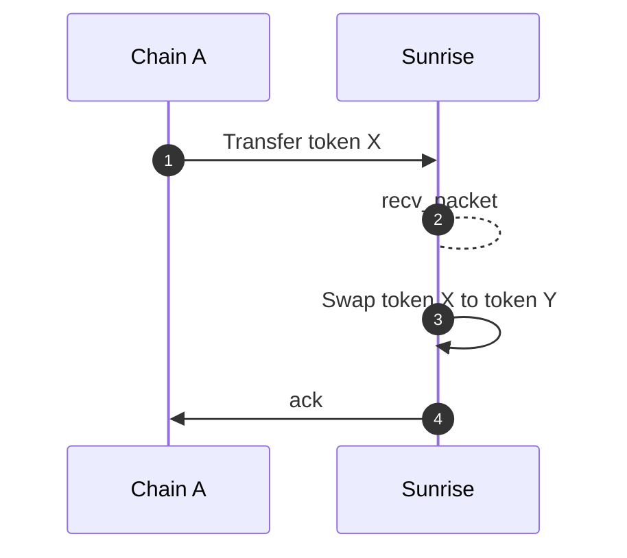
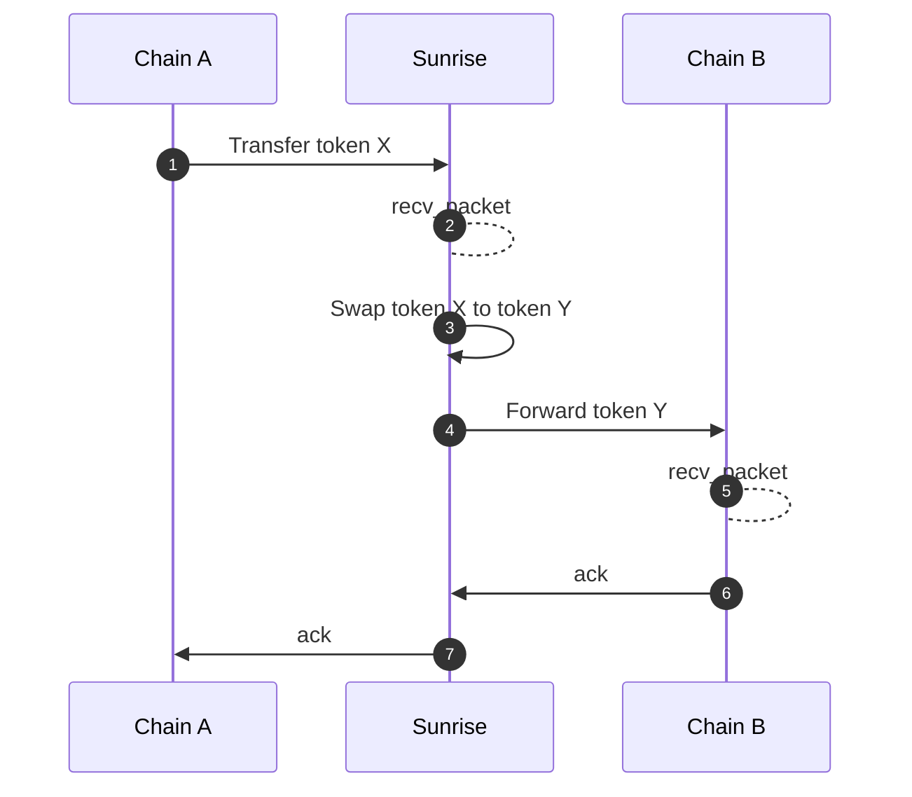
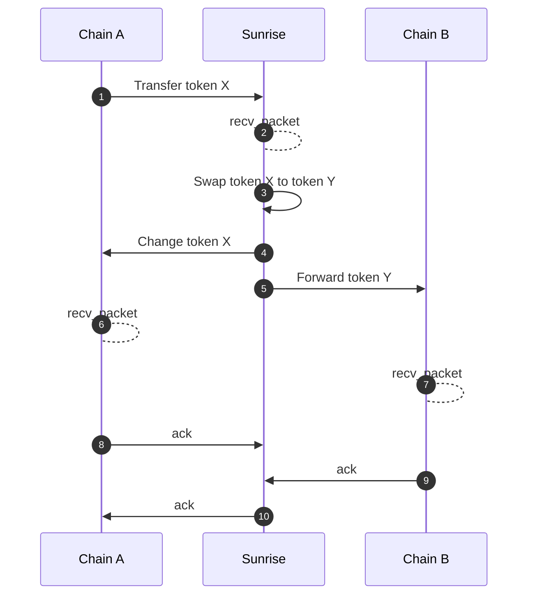

# Swap

The `x/swap` module is a protocol-level mechanism for managing token swaps within the Sunrise ecosystem. It provides a flexible and efficient way to execute token swaps, ensuring sustainable protocol economics while maintaining user accessibility.

## Key Features

- **Protocol-Level Swaps:** Centralized swap management at the protocol level
- **Flexible Swap Types:** Support for different types of token swaps
- **Efficient Execution:** Optimized swap execution mechanisms
- **Economic Sustainability:** Ensures long-term protocol viability

## Core Functionality

> **Note:** The following section covers advanced topics intended for experienced users or developers.

### Swap Management

The module manages different types of swaps:

- **Direct Swaps:** For direct token-to-token swaps
- **Multi-Hop Swaps:** For multi-step token swaps
- **Custom Swaps:** For protocol-specific swap mechanisms
- **Cross-Chain Swaps:** For cross-chain token swaps

### Swap Execution

Swaps are executed through:

- Price calculation
- Fee computation
- Slippage protection
- Liquidity updates

### Integration with Other Modules

The module integrates with:

- **x/liquiditypool:** For liquidity pool integration
- **x/fee:** For fee collection and distribution
- **x/governance:** For swap parameter management
- **x/crosschain:** For cross-chain swap integration

## Integration Points

### With Other Modules

- **x/liquiditypool:** For liquidity pool integration
- **x/fee:** For fee payment integration
- **x/governance:** For governance integration
- **x/crosschain:** For cross-chain integration

### With External Systems

- **DEXs:** For swap integration
- **Price Feeds:** For price oracle integration
- **Analytics:** For swap performance tracking

## Parameters

The module's behavior is controlled by several parameters:

- `min_swap_amount`: Minimum amount for swaps
- `max_swap_amount`: Maximum amount for swaps
- `swap_fee`: Base fee for swaps
- `slippage_tolerance`: Maximum allowed slippage
- `swap_types`: Supported swap types

## Example Usage

### Executing a Direct Swap

```go
// Execute a direct token swap
swap := types.Swap{
    Id:          "swap-1",
    Type:        types.SwapTypeDirect,
    TokenIn:     tokenIn,
    TokenOut:    tokenOut,
    Amount:      amount,
    Slippage:    sdk.NewDecWithPrec(1, 2), // 1%
    IsActive:    true,
}

err := k.ExecuteSwap(ctx, swap)
if err != nil {
    return err
}
```

### Executing a Multi-Hop Swap

```go
// Execute a multi-hop token swap
multiHopSwap := types.MultiHopSwap{
    Id:          "swap-2",
    Path:        []string{"tokenA", "tokenB", "tokenC"},
    Amount:      amount,
    Slippage:    sdk.NewDecWithPrec(1, 2), // 1%
}

err := k.ExecuteMultiHopSwap(ctx, multiHopSwap)
if err != nil {
    return err
}
```

### Updating Swap Parameters

```go
// Update swap parameters
params := types.Params{
    MinSwapAmount:     sdk.NewInt(1000),
    MaxSwapAmount:     sdk.NewInt(1000000),
    SwapFee:          sdk.NewDecWithPrec(3, 3), // 0.3%
    SlippageTolerance: sdk.NewDecWithPrec(1, 2), // 1%
    SwapTypes:        []string{"direct", "multi-hop"},
}

err := k.SetParams(ctx, params)
if err != nil {
    return err
}
```

## Benefits

1. **Efficient Execution:** Optimized swap execution mechanisms
2. **Flexible Swaps:** Support for various swap types
3. **Sustainable Economics:** Long-term protocol viability
4. **Transparent Fees:** Clear fee structure
5. **Protocol Integration:** Seamless integration with other components

## Future Improvements

1. **Dynamic Fee Adjustment:** Implement dynamic fees based on market conditions
2. **Advanced Swap Types:** Support for more complex swap mechanisms
3. **Cross-Chain Swaps:** Enable cross-chain token swaps
4. **Swap Analytics:** Better tracking and analysis of swap performance
5. **User Preferences:** Allow users to set preferences for swap execution

### Interface Provider Fee Rewards


**LEVEL 1: FOR APP DEVELOPERS**


Any frontend application, wallet, dApp, or protocol that is built on top of the swap module has the ability to earn fees. This incentivizes open, composable infrastructure around the Sunrise AMM.

There are 2 important parameters to note:

- <strong>`interface_fee_rate`:</strong> A fee, denoted in percentage, that is taken from the total amount of the swap.

- <strong>`interface_provider`:</strong> An address that specifies where the fee will be sent. If no address is provided, no interface fee will be taken.

When executing swaps through Sunrise AMM, you can **capture interface fees** by specifying your own fee recipient, maximizing profit per transaction. This function is designed to reward **any entity that facilitates swap volume**—from simple frontends to complex financial protocols.

---

### Swap Message Types


**LEVEL 1: FOR APP DEVELOPERS**


There are 2 message types that can be used to specify the amount received or the amount sent.

<strong>`MsgSwapExactAmountIn`</strong> – Swap tokens with a specified input amount

This message allows users to swap tokens by defining the exact amount of input tokens they wish to provide. The corresponding output will be calculated based on the specified input.

<strong>`MsgSwapExactAmountOut`</strong> – Swap tokens with a specified output amount

This message enables users to swap tokens by defining the exact amount of output tokens they want to receive. The system will calculate the necessary input amount to achieve the desired output.

---

### Route


**LEVEL 2: FOR ADVANCED USERS**


This module supports Swap Routes with a recursive structure, allowing for complex swaps involving multiple steps, either in sequence (Series) or simultaneously (Parallel). Each step in the route is validated and processed to ensure inputs and outputs are correctly handled.

```typescript
message RoutePool {
    uint64 pool_id = 1;
}

message RouteSeries {
    repeated Route routes = 1 [
        (gogoproto.nullable)   = false,
            (amino.dont_omitempty) = true
        ];
}

message RouteParallel {
    repeated Route routes = 1 [
        (gogoproto.nullable)   = false,
            (amino.dont_omitempty) = true
        ];
    repeated string weights = 2 [
        (cosmos_proto.scalar)  = "cosmos.Dec",
            (gogoproto.customtype) = "cosmossdk.io/math.LegacyDec",
            (gogoproto.nullable)   = false,
            (amino.dont_omitempty) = true
        ];
}

message Route {
    string denom_in = 1;
    string denom_out = 2;
    oneof strategy {
        RoutePool pool = 3;
        RouteSeries series = 4;
        RouteParallel parallel = 5;
    }
}
```

---

### Swap Middleware for ICS20 Token Transfers


**LEVEL 1: FOR APP DEVELOPERS**


Swap functionality can be automatically triggered by ICS20 token transfer packets. This is similar to IBC Hooks and can be used by any developers who can use ICS20 in any chain (like Solidity IBC Eureka, CosmWasm on Sei, etc.) to interact with the swap module through IBC middleware.

#### Metadata

A serialized `PacketMetadata` JSON string needs to be placed in the `memo` field of the ICS20 transfer packet.

```typescript
type PacketMetadata = {
    [namespace: string]: unknown;
    swap?: SwapMetadata;
};

type SwapMetadata = {
    interface_provider: string;
    route: Route;

    forward?: ForwardMetadata;
} & (
    | {
    exact_amount_in: {
        min_amount_out: string;
    };
}
    | {
    exact_amount_out: {
        amount_out: string;
        change?: ForwardMetadata;
    };
}
    );

type ForwardMetadata = {
    receiver: string;
    port: string;
    channel: string;
    timeout: string;
    retries: number;
    next?: PacketMetadata;
};
```

The `ForwardMetadata` is derived from the [Packet Forward Middleware](https://github.com/cosmos/ibc-apps/tree/main/middleware/packet-forward-middleware).

## **Sequence diagrams**


**LEVEL 2: FOR ADVANCED USERS**


#### Basic Swap Without Forwarding

In this scenario, the token transfer occurs, followed by a swap, but there is no forwarding to another chain.



#### Swap with Forwarding

In this scenario, the token is transferred, swapped, and then forwarded to another chain.



#### Swap with Excess Refunded and Forwarding

When a swap specifies an exact output amount, any excess input is automatically refunded. After the swap, the remaining tokens are forwarded to another chain.




**LEVEL 1: FOR APP DEVELOPERS**


**Receiver Address Handling**

After the swap, even if a subsequent change or transfer fails, the confirmation of "token X transfer" will always succeed. The swapped tokens remain in the receiver's account.

See [Github](https://github.com/sunriselayer/sunrise/tree/main/x/swap) for more details.
