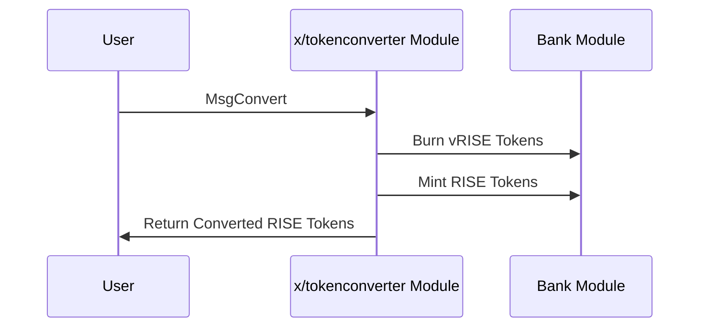

# Token Converter

The `x/tokenconverter` module enables seamless conversion between `vRISE` and `RISE` tokens on the Sunrise blockchain. This module plays a crucial role in the ecosystem by allowing users to convert between the staking token and the fee token while maintaining an equivalent value relationship.

## Key Features

1. **Bidirectional Token Conversion:**

   - Convert `vRISE` (bond denomination) to `RISE` (fee denomination) and vice versa.
   - Maintain a 1:1 equivalent value relationship between the tokens.

1. **Permissionless Operation:**

   - Any user can perform token conversions at any time.
   - No slippage or fees applied to the conversion process.

## Core Functionality

> **Note:** The following section covers advanced topics intended for experienced users or developers.

### Token Conversion

The module provides a simple and direct conversion mechanism between `vRISE` and `RISE` tokens:

- When converting vRISE to RISE, the module burns vRISE and mints an equivalent amount of RISE.
- When converting RISE to vRISE, the module burns RISE and mints an equivalent amount of vRISE. (Not available for users)

This process maintains the total economic value in the system while allowing users to hold the token type that best suits their needs.

## Workflow: Token Conversion Process

> **Note:** The following section covers advanced topics intended for experienced users or developers.



## Messages

The module provides various message types:

- MsgUpdateParams: Update module parameters (governance operation)
- MsgConvert: Convert tokens between bond and fee denominations

### MsgConvert

Converts tokens between the bond and fee denominations.

```go
type MsgConvert struct {
    Sender  string
    Amount  string
}
```

## Benefits

1. **Flexible Token Usage:**

   - Users can hold tokens in their preferred denomination.
   - Seamlessly switch between tokens based on intended use (staking vs fees).

2. **Ecosystem Integration:**

   - Supports the DA Fee Abstraction mechanism by allowing conversion between token types.
   - Facilitates the operation of other modules in the Sunrise ecosystem.

3. **Simple Design:**

   - Straightforward conversion with no fees or slippage.
   - Easy to understand and integrate with applications.

See [Github](https://github.com/sunriselayer/sunrise/tree/main/x/tokenconverter) for details.
