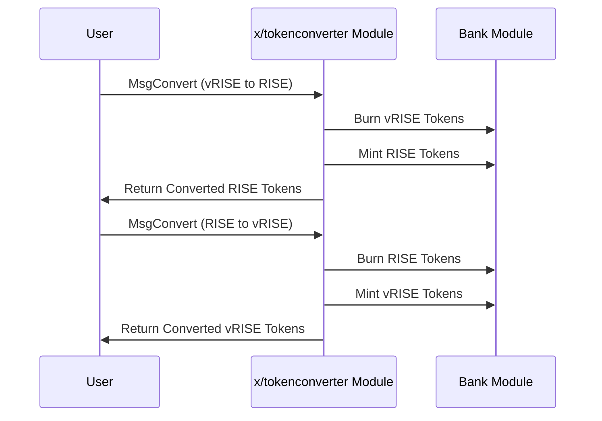

# TokenConverter

The `x/tokenconverter` module enables seamless conversion between `vRISE` and `RISE` tokens on the Sunrise blockchain. This module plays a crucial role in the ecosystem by allowing users to convert between the staking token and the fee token while maintaining an equivalent value relationship.


## Key Features

**[LEVEL 1: FOR APP DEVELOPERS]**

1. **Bidirectional Token Conversion:**

   - Convert `vRISE` (bond denomination) to `RISE` (fee denomination) and vice versa.
   - Maintain a 1:1 equivalent value relationship between the tokens.


2. **Parameter Governance:**

   - Configurable denominations through module parameters.
   - Default bond denomination: "uvRISE" (micro `vRISE`).
   - Default fee denomination: "urise" (micro `RISE`).


3. **Integrated System Component:**

   - Works alongside other modules like `x/shareclass` and `x/fee`.
   - Supports the broader tokenomics of the Sunrise ecosystem.


4. **Permissionless Operation:**

   - Any user can perform token conversions at any time.
   - No slippage or fees applied to the conversion process.


## Core Functionality

**[LEVEL 2: FOR ADVANCED USERS]**

### Token Conversion

The module provides a simple and direct conversion mechanism between `vRISE` and `RISE` tokens:

- When converting vRISE to RISE, the module burns vRISE and mints an equivalent amount of RISE.
- When converting RISE to vRISE, the module burns RISE and mints an equivalent amount of vRISE.

This process maintains the total economic value in the system while allowing users to hold the token type that best suits their needs.

## Workflow: Token Conversion Process

**[LEVEL 2: FOR ADVANCED USERS]**



## Messages

**[LEVEL 3: FOR MODULE DEVELOPERS]**

### MsgConvert

Converts tokens between the bond and fee denominations.

```go
type MsgConvert struct {
    Sender  string
    Amount  string
}
```

**Parameter Configuration**

**[LEVEL 2: FOR ADVANCED USERS]**

| Parameter                     | Description                                                                          |
|------------------------------|--------------------------------------------------------------------------------------|
| Bond Denomination (`bond_denom`) | The denomination used for staking and governance (default: `"uvRISE"`).             |
| Fee Denomination (`fee_denom`)   | The denomination used for transaction fees (default: `"urise"`).                    |

**Example Configuration:**

```json
{
  "bond_denom": "uvRISE",
  "fee_denom": "urise"
}
```

## Example Usage

**[LEVEL 1: FOR APP DEVELOPERS]**

**Query Token Converter Parameters**

```javascript
import { SunriseClient } from "@sunriselayer/client";

async function queryTokenConverterParams() {
    const client = await SunriseClient.connect("https://rpc.sunriselayer.io");
    const queryClient = client.getQueryClient();

    if (!queryClient) {
        console.error("Query client not initialized");
        return;
    }

    const params = await queryClient.tokenconverter.params({});
    console.log("Token Converter Parameters:", params.params);
}
```

**Convert Tokens**

```javascript
import { SunriseClient } from "@sunriselayer/client";
import { MsgConvert } from "@sunriselayer/client/types";

async function convertTokens() {
    const client = await SunriseClient.connect("https://rpc.sunriselayer.io");
    
    // Convert 1 vRISE to RISE
    const msgConvert = {
        sender: "sunrise1...",
        amount: "1000000"  // 1 vRISE (in micro units)
    };
    
    const result = await client.executeTransaction(msgConvert);
    console.log("Conversion result:", result);
}
```


## Benefits

**[LEVEL 1: FOR APP DEVELOPERS]**

1. **Flexible Token Usage:**

   - Users can hold tokens in their preferred denomination.
   - Seamlessly switch between tokens based on intended use (staking vs fees).


2. **Ecosystem Integration:**

   - Supports the DA Fee Abstraction mechanism by allowing conversion between token types.
   - Facilitates the operation of other modules in the Sunrise ecosystem.


3. **Simple Design:**

   - Straightforward conversion with no fees or slippage.
   - Easy to understand and integrate with applications.


See [Github](https://github.com/sunriselayer/sunrise/tree/main/x/tokenconverter) for details.