# $USDrise

$USDrise is the native stablecoin of the Sunrise protocol, issued by wrapping noble's USDN. This document provides an overview of USDrise, its features, and how it integrates into the Sunrise ecosystem.

## Overview

USDrise is designed to be a stable and reliable medium of exchange within the Sunrise protocol. It aims to maintain a 1:1 peg with the US Dollar.

There are two primary ways to acquire USDrise:

1. **Swap:** Users can also obtain USDrise by swapping other tokens, such as USDC, USDN, or RISE, through the `x/swap` module within the Sunrise ecosystem.
1. **Mint:** The issuance and burning of USDrise are managed by the `x/stable` module, which requires interaction through an authorized contract. Users can mint USDrise by depositing USDN at a fixed exchange rate of 1 USDN = 1 USDrise. This process ensures transparency and control over the token supply.

For more detailed information on the `x/stable` module, please refer to the [x/stable module documentation](../sunrise/stable.md).

## Key Features

- **Transaction Fees:** All transaction fees within the Sunrise protocol are paid in USDrise, making it a central component of the network's economy.
- **Yield Bearing:** USDrise offers a yield equivalent to that of USDN, allowing holders to earn passive income.

## Fee Mechanism and Distribution

USDrise serves as the primary token for transaction fees within the Sunrise ecosystem. The collected fees are managed by the `x/fee` module and distributed to stakeholders, creating a sustainable economic loop.

```mermaid
graph TD;
    subgraph Transaction Process
        User -- "Pay Fee in USDrise" --> Transaction;
        Transaction -- "Collect Fee" --> FeeCollector["FeeCollector Module"];
    end

    subgraph Fee Processing & Distribution
        FeeCollector -- "A portion for burning" --> SwapModule;
        SwapModule -- "Swap USDrise to RISE" --> Burn[("🔥 Burn RISE")];
        FeeCollector -- "Remaining USDrise" --> Distribution;
        Distribution -- "Rewards" --> vRISE_Stakers["vRISE Stakers"];
        Distribution -- "Rewards" --> RISE_Stakers["RISE Stakers"];
    end

    style Burn fill:#ffcccc,stroke:#333,stroke-width:2px
```

### Flow Breakdown

1. **Fee Payment:** Users pay transaction fees in **$USDrise**.
2. **Fee Collection:** The fees are sent to the `FeeCollector` module account.
3. **Burn Mechanism:** Based on the `burn_ratio` parameter in the `x/fee` module, a portion of the collected USDrise is swapped for **$RISE** and subsequently burned. This acts as a deflationary mechanism for $RISE.
4. **Reward Distribution:** The remaining USDrise in the `FeeCollector` is distributed as rewards to both **$vRISE** and **$RISE** stakers, incentivizing participation in governance and network security.

This process ensures that the usage of the network directly contributes to the value of the native tokens and rewards its most committed participants.

For more detailed information on the `x/fee` module, please refer to the [x/fee](../sunrise/fee.md).

## About USDN

USDrise is backed by Noble Dollar (USDN), a stablecoin from the noble network. It is important for users to understand the mechanics and risks associated with USDN. We strongly encourage users to conduct their own research on USDN to make informed decisions.

Noble Dollar (USDN) is a stablecoin built on the foundation of composable yield. USDN leverages the M^0 Protocol to deliver stablecoin yield collateralized by short term U.S. Treasury Bills.
USDN is purpose built for the modular ecosystem and is constructed to allow yield to be directed in a customizable, programmatic and transparent fashion.

For more information, please refer to the official documentation from Noble: [Noble Dollar (USDN)](https://www.noble.xyz/usdn)

## Related Documents

- **[x/stable Module](../sunrise/stable.md)**
